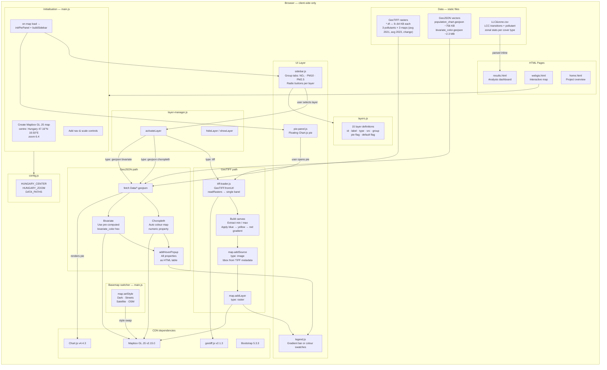

# Project Lary — Hungary Air Quality & Land Cover WebGIS

An interactive WebGIS application for exploring NO₂, PM10, and PM2.5 atmospheric pollution across Hungary (2021–2023), cross-referenced with CORINE land cover change data for Trees, Built Area, and Crops.

**Study area:** Hungary · 93,030 km² · 45.7°N–48.6°N, 16.1°E–22.9°E  
**Time period:** 2021–2023

| Cover Type | Paired Pollutant | Stability | Mean zone change |
|---|---|---|---|
| Trees | PM10 | 96.13% stable | Gain zones: −451K |
| Built Area | NO₂ | 96.00% stable | Stable zones: −2.20 µg/m³ |
| Crops | PM2.5 | 97.58% stable | Gain zones: −317M |

---

## Features

- Side-by-side GeoTIFF raster layers (annual averages + change maps) for NO₂, PM10, PM2.5
- Choropleth population-exposure layers with hover popups
- Bivariate colour-encoded analysis layers
- Floating pie chart panel showing pollutant distribution by administrative zone
- Dynamic legend that adapts per layer type
- Four basemap options: Dark (default), Streets, Satellite, OSM
- Results dashboard with transition charts (gain sources / loss destinations) and pollutant zonal statistics per cover type
- No backend required — fully client-side, static file serving

---

## Project Structure

```
Project-Lary/
├── webgis.html          # Interactive map application
├── home.html            # Landing / project overview page
├── results.html         # Analysis results dashboard (Chart.js)
├── env.js               # Mapbox public token
├── style.css            # Global styles
├── css/
│   └── webgis.css       # Map interface layout
├── js/
│   ├── main.js          # Map initialisation & basemap switcher
│   ├── config.js        # Centralised constants (coordinates, data paths)
│   ├── layers.js        # Layer metadata definitions (15 layers × 3 groups)
│   ├── layer-manager.js # Layer lifecycle: load, show, hide
│   ├── sidebar.js       # Sidebar UI builder (group tabs + radio buttons)
│   ├── tiff-loader.js   # GeoTIFF decode → canvas → Mapbox raster source
│   ├── legend.js        # Dynamic legend (gradient bar or colour swatches)
│   └── pie-panel.js     # Floating Chart.js pie panel
└── Data/
    ├── LLC&zone.csv     # LCC transition stats + pollutant zonal data (all 3 cover types)
    ├── no2/             # NO₂ GeoTIFF rasters, GeoJSON, Bar_chart.csv
    ├── pm10/            # PM10 GeoTIFF rasters & GeoJSON
    └── pm2p5/           # PM2.5 GeoTIFF rasters & GeoJSON
```

---

## LCC × Pollutant Pairing

`Data/LLC&zone.csv` contains three sections, each coupling a land cover type with its corresponding pollutant's zonal statistics:

| Section | Cover Type | Pollutant | Zone labels |
|---|---|---|---|
| 1 | Trees | PM10 | Loss · Gain · Stable |
| 2 | Built Area | NO₂ | Stable · Gain · Loss |
| 3 | Crops | PM2.5 | Gain · Loss · Stable |

Each section records: stability %, top-3 gain sources, top-3 loss destinations, and pollutant Mean/Min/Max per zone.

---

## Technical Flow



---

## Data Sources

| Dataset | Source | Format |
|---|---|---|
| NO₂ concentration maps | CAMS (Copernicus Atmosphere Monitoring Service) | GeoTIFF |
| PM10 concentration maps | CAMS | GeoTIFF |
| PM2.5 concentration maps | CAMS | GeoTIFF |
| Land cover change (Trees, Built Area, Crops) | CORINE Land Cover | CSV (zonal stats) |
| Administrative boundaries | EuroGeographics | GeoJSON |
| Population exposure grid | Derived from admin zones | GeoJSON |
| Background tiles | OpenStreetMap / Mapbox | Vector tiles |

---

## Layer Catalogue

Each pollutant group contains five layers:

| # | Layer | Type | Notes |
|---|---|---|---|
| 1 | Avg concentration 2021 | GeoTIFF | Default layer on load (NO₂ group) |
| 2 | Avg concentration 2023 | GeoTIFF | |
| 3 | Change 2021 → 2023 | GeoTIFF | Negative = improvement |
| 4 | Population exposure | GeoJSON choropleth | Pie chart enabled |
| 5 | Bivariate analysis | GeoJSON bivariate | Pre-computed hex colours |

Groups: **NO₂** · **PM10** · **PM2.5** — 15 layers total.

---

## Getting Started

1. Clone the repository
2. Add your Mapbox public token to [env.js](env.js):
   ```js
   export const MAPBOX_TOKEN = 'pk.eyJ...';
   ```
3. Serve the directory over HTTP (ES modules require a server):
   ```bash
   npx serve .
   # or
   python -m http.server 8080
   ```
4. Open `http://localhost:8080/home.html`

> **Note:** Opening HTML files directly as `file://` URLs will fail due to ES module and fetch CORS restrictions.

---

## Dependencies

All loaded from CDN — no `npm install` required.

| Library | Version | Purpose |
|---|---|---|
| [Mapbox GL JS](https://docs.mapbox.com/mapbox-gl-js/) | 2.15.0 | Map engine (vector tiles + raster layers) |
| [geotiff.js](https://geotiffjs.github.io/) | 2.1.3 | GeoTIFF decode in the browser |
| [Chart.js](https://www.chartjs.org/) | 4.4.3 | Bar charts, pie charts, zonal stat visualisations |
| [Bootstrap](https://getbootstrap.com/) | 5.3.3 | Responsive UI layout |
